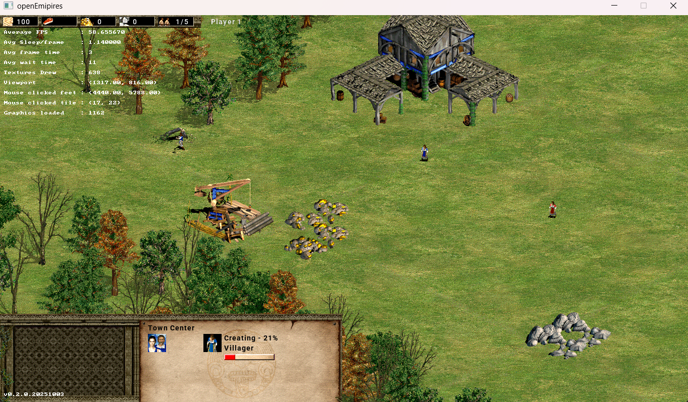

# openEmpires - README.md

# openEmpires

openEmpires is a cross-platform clone of Age of Empires 2, designed to provide a similar gameplay experience while allowing for modern enhancements and modifications. This project is built using C++ for the game logic and Python for entity definitions.



## Features (Planned)

- Real-time strategy gameplay
- Single-player and multiplayer modes
- Resource management and building mechanics
- Unit control and combat
- Modifiable game logic through Python scripting

## Getting Started

### Prerequisites

- CMake (version 3.10 or higher)
- A C++ compiler (GCC, Clang, or MSVC) - Tested against MSVC 19
- Python 3.x
- Make
- vcpkg (for C++ package management)
- [optional] clang-forma
- [optional] cppcheck

#### Installation Options (Windows)
- CMake - can be installed with visual studio on Windows
- A C++ compiler - can be installed with visual studio on Windows
- Python 3.x - can be installed with visual studio on Windows
- Make - can be installed with msys2 on Windows. nmake would not work.
- vcpkg - can be installed with visual studio on Windows
- clang-format - can be installed using pip
- cppcheck - can be installed using pip

> Note: If required clone and setup vcpkg manually to get the latest package list.

#### Dependencies
- SDL3
- SDL3-image
- GTest
- EnTT (for entity-component-system)
- spdlog (for logging)

> Note: Above dependencies will be automatically installed with `make configure` (later step)

#### Setting env variables
- Add path to CMake to the PATH variable
- Add path to C++ compiler to the PATH variable
- Add path to vcpkg to the PATH variable
- Define VCPKG_ROOT env variable which points to the vcpkg path

An example env setup in Windows might look like this;
```
$pathsToAdd = @(
    "C:\Program Files\Microsoft Visual Studio\2022\Community\Common7\IDE\CommonExtensions\Microsoft\CMake\CMake\bin",
    "C:\Program Files\Microsoft Visual Studio\2022\Community\VC\Tools\MSVC\14.44.35207\bin\Hostx86\x64",
    "C:\msys64\usr\bin",
    "C:\Program Files (x86)\Microsoft Visual Studio\Shared\Python39_64",
    "C:\Program Files (x86)\Microsoft Visual Studio\Shared\Python39_64\Scripts"
)

$currentPath = [System.Environment]::GetEnvironmentVariable("PATH", "User")
$newPath = $currentPath + ";" + ($pathsToAdd -join ";")

setx PATH $newPath
setx VCPKG_ROOT "D:\Projects\openEmpires\vcpkg\vcpkg"
```

> Note: Using setx will not update current session, a shell/IDE restart will be required after above.
> Note: Above example assumes pip installations were done globally (from a shell with admin rights)

### Building the Project

1. Clone the repository:

   ```
   git clone https://github.com/OpenEmpiresProject/OpenEmpires.git
   cd openEmpires
   ```

2. Configure the project using CMake:

   ```
   make configure
   ```

3. Build the project:

   ```
   make
   ```

> NOTE: If you get an error similar to `Cannot open include file: 'Version.h': No such file or directory`, just configure it again using `make configure` and build using `make` (this is a oneoff error)

### Running the Game

> ⚠️ **Note:** You must have the original `graphics.drs` and `terrain.drs` files from the *Age of Conquerors* (AoC) data folder.  
Place these files inside a folder named **assets** in the same directory as the `openEmpires` executable.


   ```
   make run
   ```
### Running Tests

   ```
   make test
   ```
## Contributing

We’d love your help! There are plenty of ways to contribute, and we appreciate every effort to improve the project. Please fork the repository and submit a pull request with your changes.

## License

This project is licensed under the MIT License. See the LICENSE file for details.

## Acknowledgments

- Inspired by Age of Empires 2
- Thanks to the open-source community for their contributions and support.