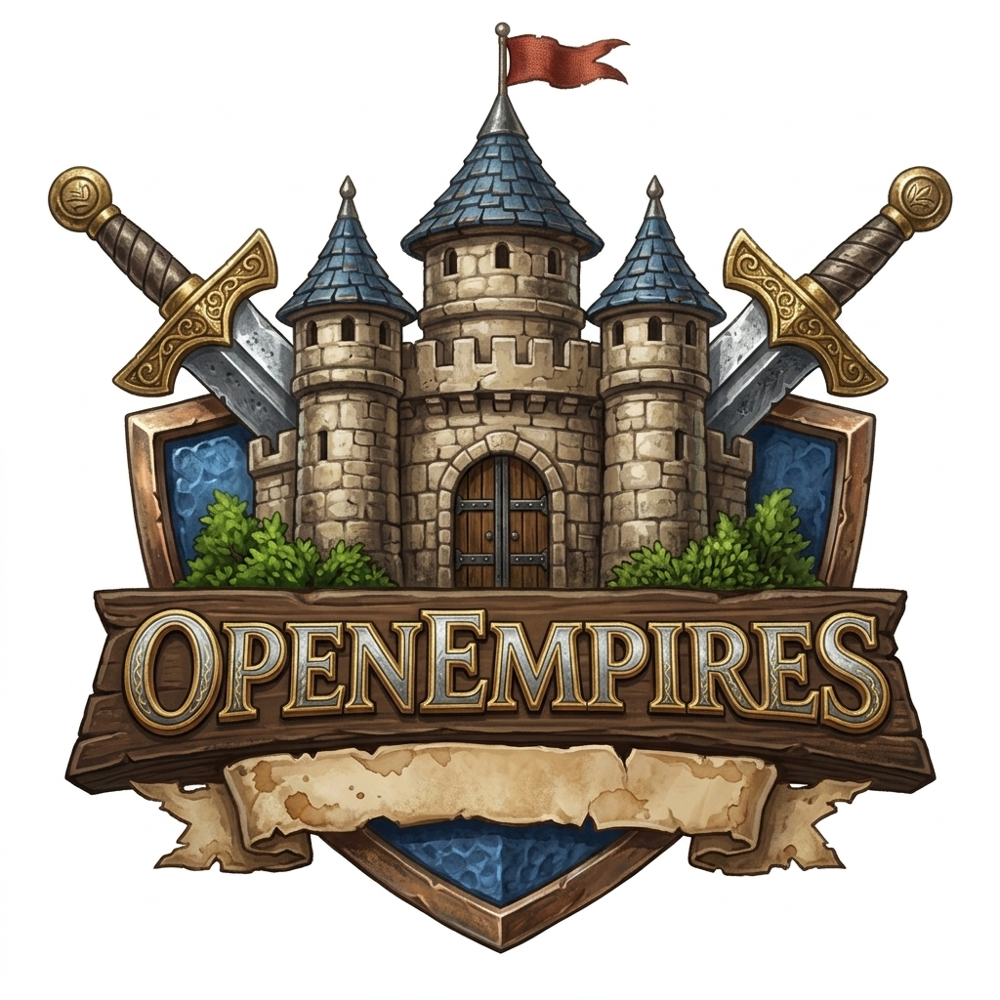
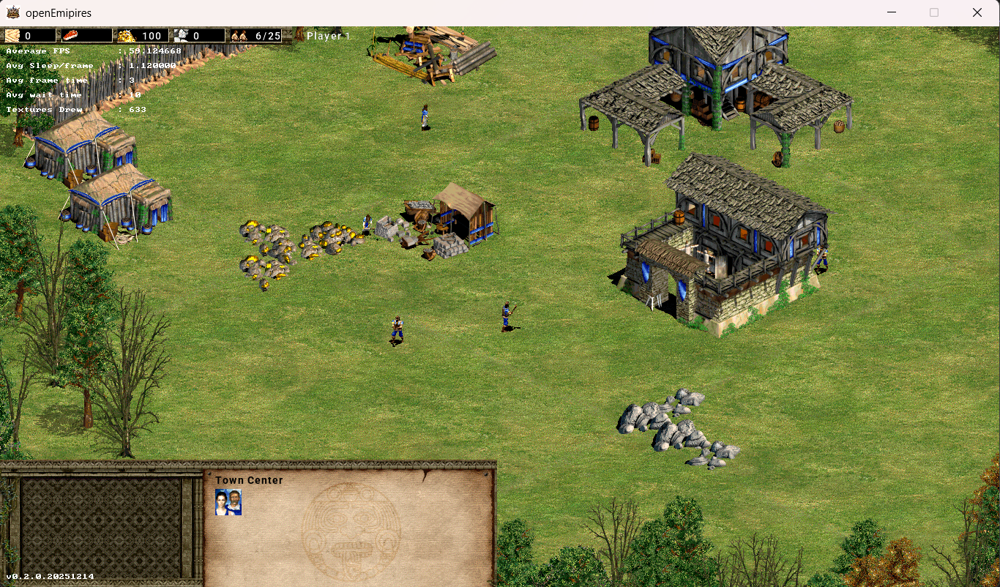

# openEmpires - README.md

<p align="center">
  
</p>

<p align="center">
    
    
    
    
    <a href="https://discord.gg/zTGvvhVm">
        
    </a>
</p>

OpenEmpires is a cross-platform, open-source clone of Age of Empires 2, built with C++ for game logic and Python for entity definitions.



## Goals

OpenEmpires has three core goals:

- **Full feature parity with AoE2** — Reproduce the complete Age of Empires 2 experience, including all gameplay systems, units, civilizations, and mechanics from the original game and its expansions.
- **Moddability** — Provide a clean, data-driven architecture that makes it easy to create, share, and apply mods without touching engine code.
- **A learning ground for RTS development** — Serve as a well-structured, open codebase that developers can study, experiment with, and contribute to in order to understand how real-time strategy games are built.

For the current status (in terms of feature parity) and roadmap, please read [ROADMAP.md](ROADMAP.md)
## Getting Started

### Step 1: Install Prerequisites

Have the following installed on your system:

- CMake (version 3.10 or higher)
- A C++ compiler (GCC, Clang, or MSVC) — tested against MSVC 19
- Python (version 3.9 or higher)
- Make
- vcpkg (for C++ package management)
- [optional] clang-format
- [optional] cppcheck

#### Installation Options (Windows)

| Tool | How to install |
|---|---|
| CMake | Via Visual Studio installer |
| C++ compiler | Via Visual Studio installer |
| Python 3.9+ | Via Visual Studio installer |
| Make | Via msys2 (`nmake` will **not** work) |
| vcpkg | Via Visual Studio installer |
| clang-format | `pip install clang-format` |
| cppcheck | `pip install cppcheck` |

> **Note:** If needed, clone and set up vcpkg manually to get the latest package list.

#### C++ Dependencies

The following are installed automatically by `make configure`:

- SDL3
- SDL3-image
- GTest
- EnTT (entity-component system)
- spdlog (logging)
- pybind11
- pydantic (Python dependency)

### Step 2: Set Up Environment Variables

Add the required tools to your `PATH` and define `VCPKG_ROOT`. An example setup for Windows:

```powershell
$pathsToAdd = @(
    "C:\Program Files\Microsoft Visual Studio\2022\Community\Common7\IDE\CommonExtensions\Microsoft\CMake\CMake\bin",
    "C:\Program Files\Microsoft Visual Studio\2022\Community\VC\Tools\MSVC\14.44.35207\bin\Hostx86\x64",
    "C:\msys64\usr\bin",
    "C:\Program Files (x86)\Microsoft Visual Studio\Shared\Python39_64",
    "C:\Program Files (x86)\Microsoft Visual Studio\Shared\Python39_64\Scripts"
)

$currentPath = [System.Environment]::GetEnvironmentVariable("PATH", "User")
$newPath = $currentPath + ";" + ($pathsToAdd -join ";")

[System.Environment]::SetEnvironmentVariable("PATH", $newPath, "User")
setx VCPKG_ROOT "D:\Projects\openEmpires\vcpkg\vcpkg"
```

> **Note:** Be mindful of the character limit in the `PATH` variable and the `setx` command — the example above avoids this.
> **Note:** Changes won't apply to the current session; restart your shell or IDE after updating.
> **Note:** The example assumes pip packages were installed globally (from a shell with admin rights).

### Step 3: Build the Project

1. Clone the repository:

   ```bash
   git clone https://github.com/OpenEmpiresProject/OpenEmpires.git
   cd openEmpires
   ```

2. Configure the project:

   ```bash
   make configure
   ```

3. Build:

   ```bash
   make
   ```

> **Note:** If you see `Cannot open include file: 'Version.h': No such file or directory`, run `make configure` again followed by `make`. This is a one-off issue.

### Step 4: Run the Game

> ⚠️ You must have the original `graphics.drs`, `terrain.drs`, and `interfac.drs` files from the *Age of Conquerors* (AoC) data folder. Place these inside a folder named **`assets`** in the same directory as the `openEmpires` executable.

```bash
make run
```

#### Keyboard Shortcuts

| Key | Action |
|---|---|
| `c` | Build Town Center |
| `m` | Build Mill |
| `l` | Build Lumber Camp |
| `n` | Build Mining Camp |
| `b` | Build Barracks |
| `h` | Build House |
| `p` | Build Palisade |
| `o` | Build Stone Wall |
| `i` | Build Stone Gate |
| `g` | Garrison |
| `u` | Ungarrison |
| `v` | Produce Villager (from Town Center) |
| `m` | Produce Militia (from Barracks) |

### Running Tests

```bash
make test
```

## Contributing

We'd love your help! There are plenty of ways to contribute, and we appreciate every effort to improve the project. Please fork the repository and submit a pull request with your changes.

### AI-Generated Code Policy

This project does not accept pull requests or code contributions that are wholly or substantially generated by AI tools (including, but not limited to, large language models, code-generation assistants, and automated coding agents).

We believe that meaningful open-source contribution comes from human understanding, judgment, and craft. AI-generated code often introduces subtle issues that are difficult to review, and accepting it conflicts with the project's goal of being a genuine learning ground for developers. If you used AI tools to assist your work (e.g. for research, documentation, or understanding a concept), that's fine — but the code you submit should be your own.

Pull requests that appear to be substantially AI-generated will be closed without review.

For more information, please refer please read [AI-Policy.md](ai-policy.md)
## License

This project is licensed under the MIT License. See the [LICENSE](LICENSE) file for details.

## Acknowledgments

- Inspired by Age of Empires 2
- Thanks to the open-source community for their contributions and support
