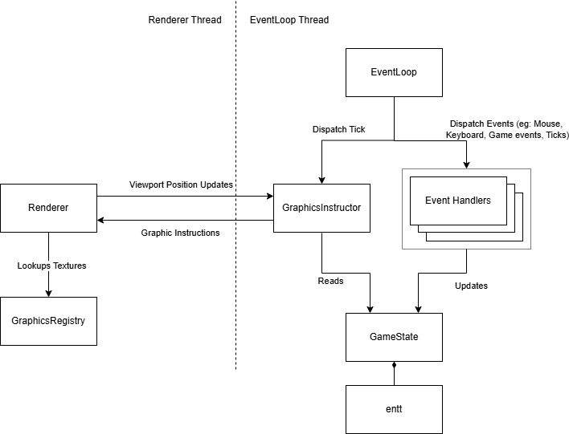
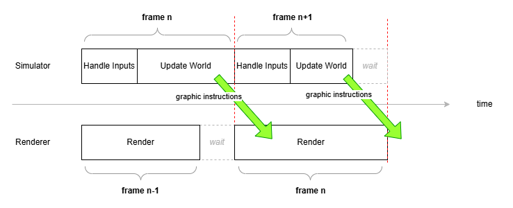

# Open Empires Architecture

This document outlines the architecture of the **Open Empires** game.

## Overview

**Open Empires** is a free and open-source clone of the classic *Age of Empires II*, built with a strong emphasis on **moddability** and **extensibility**. It employs a **multi-threaded architecture**, where major subsystems may operate independently in separate threads to improve performance and responsiveness.

## Architecture Diagram

## Core Components

### Renderer
- Runs on its own thread.
- Receives **graphic instructions** from the Simulator.
- Maintains its **own copy of the graphic state** based on these instructions.
- Uses the **SDL3** library for rendering.

The Renderer also captures **keyboard and mouse events** and handles viewport movement and selection box rendering directly, to ensure smooth and responsive interactions.  
> ⚠️ These input events are **not forwarded** to the Simulator; it captures inputs independently.

### EventLoop
- Operates in its own thread.
- Maintains a consistent **frame rate**.
- Generates **simulation ticks**.
- Captures and distributes **input events** (keyboard, mouse) to relevant subsystems.

### Simulator
- Runs on the **same thread as the EventLoop**.
- Updates the game world each frame (tick) and sends corresponding rendering instructions to the Renderer.
- Synchronizes with the Renderer at the end of each frame, ensuring that simulation and rendering proceed in lockstep.

Together, the Simulator and Renderer form the core game loop:

1. **Input Handling:** Process input (mouse, keyboard).
2. **Update:** Run systems to update the game world (simulation).
3. **Rendering:** Render the updated state.

> ℹ️ The Renderer always displays **one frame behind** the Simulator due to synchronization.

Synchronization between Simulator and Renderer can occur on either side, depending on timing.

### GameState
Open Empires uses an **Entity-Component-System (ECS)** model powered by the [`entt`](https://github.com/skypjack/entt) library. It manages all game entities—such as units, buildings, and resources—through data-driven components.

Unlike traditional **Object-Oriented Programming (OOP)** approaches, Open Empires does **not encode behavior into objects**. Instead, behavior is handled by **systems** that operate on components. This enables:

- Clean separation of data and logic
- Better performance and cache locality
- Easier modding and testing
- More scalable and reusable design

### CommandCenter
- Runs on the same thread as the EventLoop and Simulator.
- Manages **command queues** for entity actions.
- Each high-level behavior (e.g., moving, harvesting, idling) is represented as a **command**.
- Responsible for transitions like a villager returning to idle after completing a task.

In essence, CommandCenter abstracts **game logic into command execution**, allowing flexible, layered behaviors.

## Design Philosophy

> ⚠️ **Are we building a generic game engine?**  
No — we are **not** in the business of creating a general-purpose RTS engine. Our focus is to **do the bare minimum required** to get **Open Empires** up and running as a fully playable, moddable, and extensible game.

> 🤔 **Then why not use an existing game engine?**  
We chose **not** to rely on large, general-purpose game engines because we need **fine-grained control and performance**. Open Empires plans to go **beyond the original 8-player limit** and support **thousands of units** in real time — something that would be harder to achieve efficiently with existing engines.

> 💡 **We intend and promise** to maintain the ability to **run this version on low-end systems**, just like the original game. Performance, scalability, and accessibility are all first-class goals of this project.

## Modules

The project is modular, structured to separate core responsibilities into focused components:

| Module         | Description |
|----------------|-------------|
| **Core**       | ECS, simulation loop, game state, and foundational engine logic. |
| **Rendering**  | Renders the game world using SDL3. Designed to support multiple backends (e.g., OpenGL, Vulkan). |
| **Audio** *(Planned)*      | Handles playback of sound effects and music. |
| **Networking** *(Planned)* | Adds support for multiplayer sessions. |
| **Scripting** *(Planned)*  | Integrates scripting (e.g., Lua or Python) for modding and automation. |
| **UI** *(Planned)*         | Manages user interface elements like HUD, menus, and tooltips. |

---

Let us know if you're interested in contributing or extending the architecture — it's built to grow.