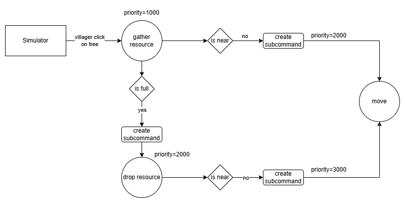

# 🛠️ Command Execution System Design

## 🎯 Overview
The **CommandCenter (CC)** is responsible for managing the execution of prioritized commands for in-game units. Each unit has a `commandQueue`, implemented as a `priority_queue` in its `CompUnit` component. On each game tick, the CC iterates through all active units and executes the top-priority command via its `onExecute` method.

If `onExecute()` returns `true`, the command is considered complete and is removed from the queue. Commands can also create sub-commands to fulfill prerequisites they cannot currently satisfy. For example, a command to gather resources may require the unit to move closer to the target first.

---

## ⚙️ Command Queue Mechanics
- Commands are prioritized using integer values (higher = higher priority).
- Sub-commands are inserted with priorities **higher** than the current command to ensure they are executed first.
- The command lifecycle may involve chaining sub-commands to meet spatial or logical preconditions before resuming the main command.

---

## 🌲 Example: Resource Gathering Workflow

This example walks through how a **villager gathers wood** from a tree using the command system.  
The diagram below visually complements the explanation:



### 📌 Step-by-Step Breakdown

1. **Command Issued**  
   - When a player selects a **villager** and clicks on a **tree**, the **Simulator** issues a `CmdGatherResource` to the villager.  
   - The default priority for this command is `1000`.

2. **Resource Not Nearby**  
   - If the villager is not close enough to the tree, `CmdGatherResource` creates a `CmdMove` sub-command with **priority = 2000**.  
   - The unit's `commandQueue` becomes:  
     ```
     [ CmdMove (2000), CmdGatherResource (1000) ]
     ```

3. **Move and Gather**  
   - Once `CmdMove` completes, `CmdGatherResource` is resumed.  
   - The villager begins gathering wood at a rate influenced by factors like civilization bonuses and age.

4. **Inventory Full**  
   - When the villager's inventory is full, `CmdGatherResource` generates a `CmdDropResource` sub-command with **priority = 2000**.  
   - The queue is now:  
     ```
     [ CmdDropResource (2000), CmdGatherResource (1000) ]
     ```

5. **Drop Location Not Nearby**  
   - If a drop site (like a lumber camp or town center) is not nearby, `CmdDropResource` creates a `CmdMove` sub-command with **priority = 3000**.  
   - Updated queue:  
     ```
     [ CmdMove (3000), CmdDropResource (2000), CmdGatherResource (1000) ]
     ```

6. **Move and Drop**  
   - After the villager moves to the drop site, `CmdDropResource` executes and transfers the collected wood to the player.  
   - Queue becomes:  
     ```
     [ CmdDropResource (2000), CmdGatherResource (1000) ]
     ```

7. **Resume Gathering**  
   - Once resources are dropped off, `CmdDropResource` completes, and control returns to `CmdGatherResource`.  
   - If the original tree is no longer nearby, another `CmdMove` is issued—repeating the cycle as necessary.

---

## ✅ Summary

This command structure supports:
- **Composable behavior**: Higher-level commands delegate to sub-commands.
- **Interruptibility**: Priority ensures contextually urgent actions (like moving before gathering) are handled first.
- **Resumability**: Once sub-commands complete, the original command continues seamlessly.

This modular design keeps unit behavior clean, predictable, and extensible, aligning well with the command-pattern logic in RTS games.
