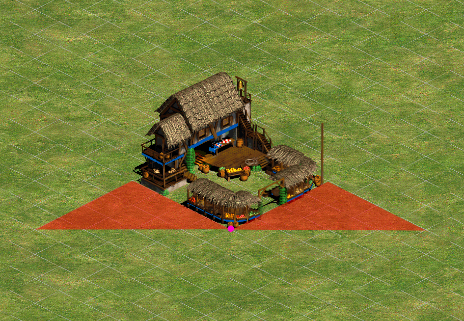
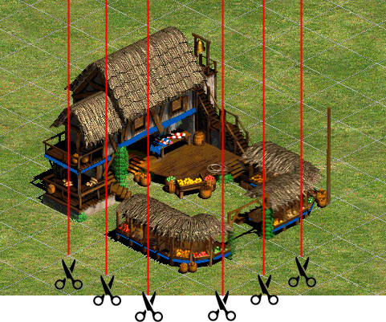
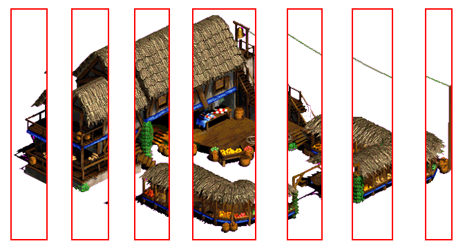
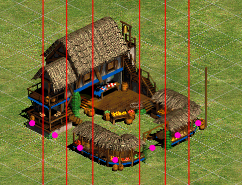

# 🧩 Z-Ordering in Renderer

The `Renderer` does not handle Z-ordering on its own. Instead, it delegates this responsibility to implementations of a common interface, `ZOrderStrategyBase`. The selected strategy determines the correct rendering order of all components, and the `Renderer` renders them strictly in the order returned by the strategy. This design allows for maximum flexibility and easy improvements or substitutions to the Z-ordering algorithm in the future.

Currently, the only implementation in use is **`ZOrderStrategyWithSlicing`**.

---

## 🧠 Why Slicing is Necessary

In isometric game worlds, relying on a single z-value for each image is often insufficient, especially for wide images that span multiple tiles. A large structure (like a marketplace) might overlap with entities positioned at varying depths. This creates complex visibility scenarios.

For example:

In the diagram above, the pink circle marks the z-value of the marketplace. Any unit in the red zone technically has a *lower* z-value than the marketplace. If the renderer were to simply draw images by z-value alone, the marketplace would be drawn after these units—potentially obscuring them fully or partially, even though they should appear in front.

---

## 🪚 The Slicing Approach

To address this, `ZOrderStrategyWithSlicing` slices wide images horizontally into **"slicers"**—each no more than 1 tile wide. This ensures that each slicer can be assigned its own appropriate z-value, based on its horizontal position in the game world.

This transformation happens as follows:

1. When the `Renderer` receives a **graphic instruction** from the **Simulator**, it doesn’t immediately forward it to the GPU.
2. Instead, the instruction is **decomposed** into multiple **sub-rendering components** using the slicing algorithm.
3. Each slicer inherits part of the visual data from the original image but is now rendered as an independent entity.

Illustration:

> The large image is divided into several 1-tile-wide slicers.

---

## 🔍 How the Renderer Sees It

After slicing, the `Renderer` no longer sees a single wide image. Instead, it sees multiple narrow sub-images (slicers), each with their own z-values.

These slicers are then **sorted by their individual z-values** and rendered in that order:

> Here pink circles shows the new independent z values.

This approach guarantees correct visual stacking in complex overlapping scenarios, preserving depth perception and visual clarity.

---

## ✅ Benefits

- **Accurate overlap handling**: Entities are rendered in visually correct order, even around large buildings.
- **Modular strategy**: The z-ordering logic is completely pluggable via the `ZOrderStrategyBase` interface.
- **Fine-grained control**: Each subcomponent can have its own precise z-depth.

---

## 🛠️ Extensibility

The architecture is intentionally flexible. New z-ordering strategies can be added in the future by implementing `ZOrderStrategyBase`, such as:

- Priority-based ordering
- Distance-from-camera strategies
- Hybrid approaches combining slicing with explicit layers
