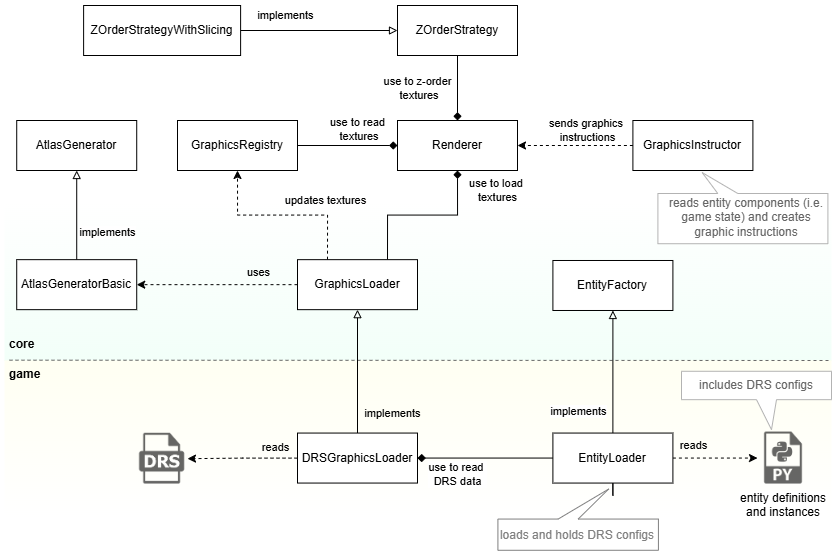
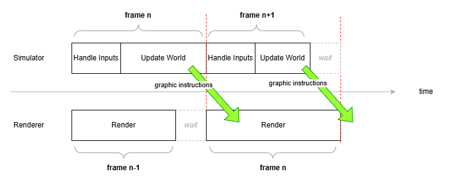

# Renderer Architecture

This document provides a detailed overview of the `Renderer` subsystem in Open Empires.

## Overview

The `Renderer` is a core component responsible for all visual output of the game. It is designed for high performance and responsiveness by operating in its **own dedicated thread**, separate from the main game simulation loop. This multi-threaded approach ensures that rendering and user interactions, like moving the camera or drawing a selection box, remain smooth and fluid, even when the game simulation is under heavy load.

The `Renderer` uses the **SDL3** library for low-level rendering operations and is designed to be backend-agnostic, although it currently uses the default SDL renderer.

## Core Responsibilities

The `Renderer`'s primary duties include:

1.  **Initialization**: Sets up the SDL environment, creates the game window, and initializes the rendering context.
2.  **Dedicated Render Loop**: Runs a continuous loop to draw frames at a consistent rate.
3.  **Data Synchronization**: Receives rendering instructions from the `GraphicsInstructor` via a double-buffered `ThreadSynchronizer`.
4.  **Component Processing**: Transforms high-level `CompGraphics` instructions (received from `GraphicsInstructor`) into low-level, drawable `CompRendering` components.
5.  **Z-Ordering**: Sorts all drawable components to ensure correct visual depth and layering using a pluggable strategy (`ZOrderStrategy`).
6.  **Direct Input Handling**: Captures and processes mouse and keyboard events for viewport movement and selection box drawing, bypassing the main simulation loop for maximum responsiveness.
7.  **Rendering Primitives**: Draws textures, text, UI elements, and debug overlays to the screen.

> NOTE: `Renderer` does not send captured inputs back to `EventLoop`. `EventLoop` is designed to capture inputs independently.
## Design

`Renderer` deligates 4 main responsibilities to other subsystem:
1. Game state to graphic instruction translation: Done by `GraphicInstructor`
2. Graphics loadup: Done by `GraphicsLoader` initerface where currently implemented to use DRS files.
3. Graphics storage and lookup: Done by `GraphicsRegistry` (which is populated by the `GraphicsLoader`)
4. Z-Ordering: Done by `ZOrderStrategy` where currently implemented to use a tile based sorting strategy.

And it is designed to prevent leaking any specific image storage implementations (such as DRS files) to the engine/core.

## Threading and Synchronization

The `Renderer` runs completely independently of the `EventLoop` and `GraphicsInstructor` (which run together on the main thread). This separation is a cornerstone of the engine's architecture, designed to decouple rendering performance from simulation performance.

Synchronization is managed by the `ThreadSynchronizer<FrameData>` class, which implements a double-buffering pattern.

1.  The `GraphicsInstructor` (the "sender") writes all the graphic updates for a single frame into one buffer.
2.  Once done, it signals the `Renderer` (the "receiver") and swaps buffers.
3.  The `Renderer` can now safely read and render the completed frame's data from its buffer while the `GraphicsInstructor` begins writing the *next* frame's data into the other buffer.

This ensures that the `Renderer` always works with a complete and consistent set of data for each frame, preventing visual artifacts like tearing. As a result, the `Renderer` always displays the game state **one frame behind** the simulation.

> ℹ️ The Renderer always displays **one frame behind** the GraphicInstructor due to synchronization.

Synchronization between GraphicInstructor and Renderer can occur on either side, depending on timing.

## The Rendering Pipeline

Each frame, the `Renderer` executes a series of steps to draw the world:

1.  **Read Graphics Instructions**: From the `ThreadSynchronizer`.

2.  **Process Graphic Instructions and Load Textures**: Processes the `graphicUpdates` received from the `GraphicsInstructor`.
    - It iterates through the incoming `CompGraphics` instructions.
    - For each instruction, it populates a corresponding `CompRendering` component, which is the `Renderer`'s internal representation of a drawable object.
    - If a required texture isn't loaded, it's added to a queue and loaded via the `GraphicsLoader`.

3.  **Render Background**: Clears the screen with a solid color.

4.  **Render Game Entities**:
    - It asks the `ZOrderStrategy` to sort all textures.
    - It iterates through the sorted list and renders each texture. This includes:
        - **Graphic Addons**: Renders selection circles, build-site rhombuses, or text labels associated with an entity.
        - **Main Texture**: Renders the entity's primary texture (e.g., a unit's sprite).
        - **Debug Overlays**: If enabled, draws debug shapes like bounding boxes or pathing lines.

5.  **Render UI and Cursor**: Renders the selection box and updates the mouse cursor graphic.

6.  **Render Debug Info**: If enabled, it displays performance statistics like FPS, frame time, and other debug text.

7.  **Present**: Swaps the SDL back-buffer to the screen.

## Z-Ordering

A critical responsibility of the `Renderer` is to draw entities in the correct order to create a convincing illusion of depth. This is delegated to a `ZOrderStrategy` implementation.

The current strategy, `ZOrderStrategyByTiles`, addresses the challenges of Z-ordering in an isometric view, especially with large sprites that span multiple tiles.
> For a more detailed explanation, see [Tile Based Z-Ordering](./zordering-by-tiles.md).

## Font Rendering

Text rendering is optimized by using a **font atlas**. On initialization, the `Renderer` pre-renders all required characters (ASCII 32-126) from a TTF font file onto a single large texture (`FontAtlas`).

When `renderText` is called, it draws the text by rendering a sequence of small rectangles from this atlas, one for each character. This is far more performant than creating a new texture for every piece of text on every frame.

## Debugging Features

The `Renderer` provides some metrics around performance and capabilities for debugging, toggleable at runtime:

- **Performance Stats**: Displays FPS, frame time, and time spent waiting for the simulation thread.
- **Debug Text**: Any part of the engine can submit lines of text to be displayed on screen.
- **Debug Overlays**: Systems can attach `DebugOverlay` data to game entities to draw shapes (circles, arrows, rhombuses) relative to an entity's position, which is useful for visualizing things like collision boxes and velocity vector.

