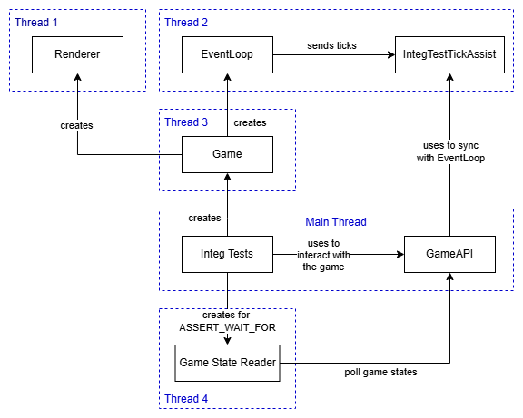

# Testing OpenEmpires

OpenEmpires relies on two levels of automated testing:

1. **Unit testing**
2. **Integration testing**

Both use the [Google Test](https://github.com/google/googletest) framework.

---

## ✅ Unit Testing

Unit testing in OpenEmpires validates individual behaviors and logic in isolation. We do **not** enforce strict code coverage thresholds, so we rely on developers’ good judgment to ensure meaningful coverage.

All unit test source files live in the `tests` directory.

### ▶️ How to run unit tests

```bash
make tests
```

## ✅ Integration Testing
Because OpenEmpires is an open-source project without a dedicated QA team, we need a robust, automated approach to integration testing.

Our strategy is to launch the full game in a prefabricated, testable configuration and drive it through a dedicated interface (`GameAPI`).

### 🗂️ Key design points
- The game runs on **its own thread** during tests.

- GoogleTest runs in the **main thread**, sending commands and validating state via `GameAPI`.

- `GameAPI` uses `IntegTestTickAssist` (an `EventHandler` implementation) with `mutex` locking to sync with `EventLoop` for each interaction to achieve the thread-safety. Essentially, each game interaction through `GameAPI` would pause the the game briefly.

- Required setup is handled in the `IntegTestBase` fixture, which must be the base class for all integration tests.

- **NOTE:** All integration tests must use test fixtures derived from `IntegTestBase`.

### 🧭 Recommended Practice
- Always use the provided ASSERT_WAIT_FOR macro to wait for game state transitions after issuing a command, following the Arrange-Act-Assert (AAA) testing pattern.
- Avoid using raw sleep calls to reduce test flakiness and improve clarity.

### 📜 Example Integration Test
Below is a minimal example that validates a villager walking a short distance:
```cpp
class MovementsTest : public IntegTestBase
{
};

TEST_F(MovementsTest, VillagerWalk) 
{
    auto player = m_api->getPrimaryPlayer();
    auto villager = m_api->createVillager(player, Feet(5000, 5000));

    m_api->commandToMove(villager, Feet(6000, 5000));

    ASSERT_WAIT_FOR(m_api->getCurrentAction(villager) == UnitAction::MOVE, 1000);
    ASSERT_WAIT_FOR((m_api->getUnitPosition(villager) - Feet(6000, 5000)).length() < 100, 5000);
}
```

All unit test source files live in the `integ-tests` directory.


### 📐 Integration Testing Architecture
The diagram below illustrates the architecture of our integration testing setup:



### ▶️ How to run integration tests

```bash
make integ-tests
```

If you’re contributing integration tests, please follow these guidelines to help keep the test suite maintainable and robust.

