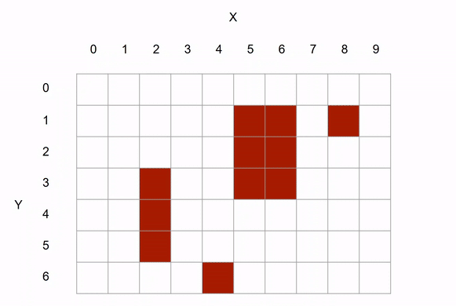

# 🧩Tile based Z-Ordering in Renderer
The `Renderer` does not handle Z-ordering on its own. Instead, it delegates this responsibility to implementations of a common interface, `ZOrderStrategy`. The selected strategy determines the correct rendering order of all components, and the `Renderer` renders them strictly in the order returned by the strategy. This design allows for maximum flexibility and easy improvements or substitutions to the Z-ordering algorithm in the future.

This document describes design, data structures and algorithm used by [`core::ZOrderStrategyByTiles`](src/cpp/core/ZOrderStrategyByTiles.h) - an implementation of `ZOrderStrategy` API -.

## Purpose

`core::ZOrderStrategyByTiles` implements a z-ordering strategy for the Renderer. It:

- Maintains a light-weight, local spatial map of entities/graphics (using a`TileMap`) for ordering. This is done by replicating the `TileMap` using graphic instructions recieved to the Renderer.
- Produces a single ordered vector of `CompRendering*` for the `Renderer` to draw.
- Being able to correctly handle large (i.e. multi-tile) entities such as buildings.

## High-level algorithm

At high-level, the approach is to traverse through each cell for each Y, and render only when all the dependent entities (i.e. lower z) are rendered.

> Red clusters indicate buildings. Circular green check sign indicates when the tile is rendered.

- For each row y and column x:
    - Skip tiles already marked processed or outside an extended viewport (viewport extended by horizontal and vertical margins to draw off-screen overlapping textures).

    - For each entity occupying that tile:

        - If single-tile entity (i.e. not a building):
            - Calculate relative z value (i.e. within tile z value) and save to sort later

        - If multi-tile (i.e. building):
            - Detect whether current tile is the bottom-left logical corner for that entity. Only at the corner the building is being rendered. This ensures all the dependencies are already rendered.

            - If corner not yet reached for that entity, push entity into pendingEntities and pause continuing x traversal to resolve dependencies later. When all the dependencies are rendered, then render the entity and continue where left-off previously.
    - After processing all entities of the tile, sort all non-multi-tile entities by previously calculated z values.

### Within-tile ordering

When multiple entities occupy the same tile, they must be ordered by subtle offsets so overlapping looks correct. The strategy:

- Compute a within-tile z-order using relative offsets:
  - z = relativeX + relativeY
- Use Versioned Bucket Sort (a variant of Counting/Bucket Sort optimized to reduce cleanup) to sort entities inside the tile by their z values

### UI layer

- UI items are not placed in world tiles. They are stored by screen-space Y to simulate vertical stacking for overlays.

## Updates & consistency

- `ZOrderStrategyByTiles` maintains its own copy of `TileMap`:
  - If an entity changes tile or size, it is removed from its previous tile and added to the new one.
  - Disabled/destroyed entities are removed.
  - UI-layer items are indexed separately.
- Updates happen only when/if new graphic instructions are recieved from the simulation thread (via `GraphicInstructor`)

## Performance
### Extended viewport
Extended viewport is being used to reduce the number of tiles the algorithm has to process. Extended viewport is basically an enlarged viewport by a small margin. For instance, if the screen resolution is 1000x700 (then the viewport would be; 0,0,1000,700) then the extended viewport can be -100, -100, 1100, 800. 

Extended viewport culling operates only on the tiles, but not entities inside them. This enhances the performing since entity iteration and entity property access is not required.

Extended viewport can reduce number of tiles to process significantly, even upto 99% at some settings. For instance;
- if the resolution is 1080x720 and the game map is 256x256 tiles
- with 4 layers of graphics (ground, on-ground, entities, sky), the total number of tiles to typically process per frame is 256x256x4=262,144
- with extended viewport of -200,-250,1280,970, total number of tiles to process reduces to roughly 169x4=676 tiles. 
- extended view port culling has reduced the number of tiles to process by staggering 99.74% in above example setup.

This approach prevents performance from degrading in proportion to the overall game map size.

### View-frustum culling
Once all the z value calculations are done, the typical viewport will be used to do the frustum culling to prevent rendering textures outside of viewport. This is in addition to the extended viewport, but done per entity instead of per tile.

## Complexity

- Work per frame is proportional to the number of tiles and entities inside the extended viewport.
  - If $v$ is number of visible tiles and $e$ is number of entities in that viewport, expected complexity is approximately $O(v + e)$ for building buckets and $O(e)$ to flatten into the final list.
- Within-tile bucketization is near-constant-time per entity; clearing uses versioning to avoid linear resets.

## Quick references

- Class: [`core::ZOrderStrategyByTiles`](src/cpp/core/ZOrderStrategyByTiles.h)
- Implementation: [src/cpp/core/ZOrderStrategyByTiles.cpp](src/cpp/core/ZOrderStrategyByTiles.cpp)
- Related types:
  - [`core::CompRendering`](src/cpp/core/components/CompRendering.h)
  - [`core::TileMap`](src/cpp/core/TileMap.h)
  - [`core::Coordinates`](src/cpp/core/Coordinates.h)
  - [`core::Settings`](src/cpp/core/Settings.h)
  - [`core::Flat2DArray`](src/cpp/core/Flat2DArray.h)
  - Base interface: [`core::ZOrderStrategy`](src/cpp/core/ZOrderStrategy.h)